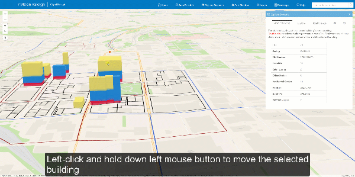
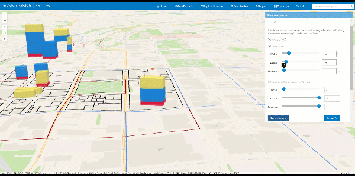
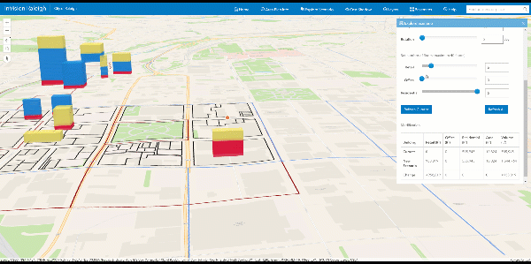
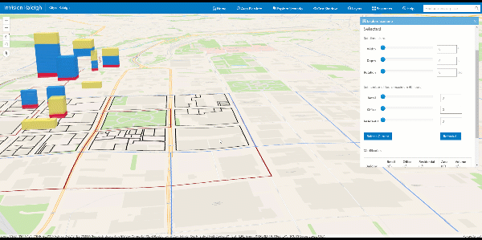

# NextCenturyCities

http://152.1.0.24/InVisionRaleigh_May

### ESRI software:
 * ArcGIS JavaScript API 4.3 (https://developers.arcgis.com/javascript)
 * Building drag function by Richie Carmichael / ESRI Prototype Lab (https://github.com/richiecarmichael/Esri-Building-Drag-Sample)
 * ArcGIS Online (https://www.arcgis.com/home/index.html)
 * UIs
   * Calcite Web (https://esri.github.io/calcite-web)
   * Calcite Maps (https://esri.github.io/calcite-maps/samples/index.html)
### Other software:
* jQuery (https://jquery.com)
* bootstrap-slider (https://github.com/seiyria/bootstrap-slider)
* jQuery Popup Overlay (https://github.com/vast-engineering/jquery-popup-overlay)
* C3.js (http://c3js.org) 

 

## InVision Raleigh Prototype Application Documentation

http://152.1.0.24/inVisionRaleigh/help.html

### Explorer Scenario Tool
The scenario tool allows users to explore alternative planning scenarios by altering existing buildings and creating new buildings.

User can:

* move buildings
* modify dimensions (width, depth, and rotation)
* modify the number of floors for retail, office and/or residential use
* create new buildings
* see summary reporting of the selected building modification(s)
* see total gross square foot change of the scenario at the area planning level

*Moving the selected building*

*Modifying dimensions*

*Modifying the number of floors*

*Creating a new building*

